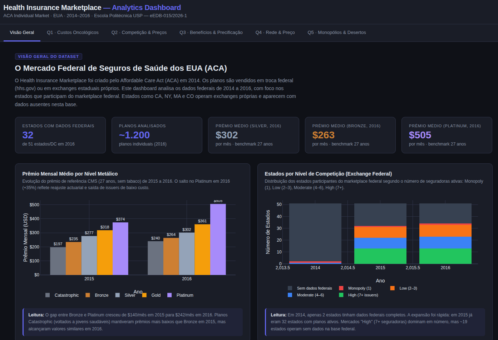
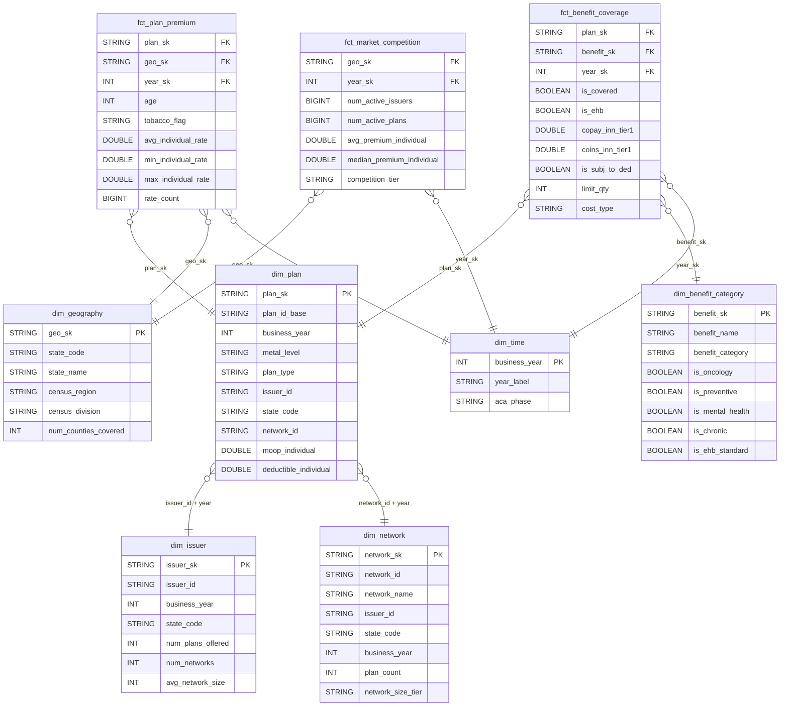

# Projeto Integrador eEDB-015/2026-1
### Health Insurance Marketplace — Pipeline de Dados & Análise (Grupo 05)

Repositório da disciplina **Projeto Integrador (eEDB-015/2026-1)** — Curso de Especialização em Big Data, Escola Politécnica da USP.

---

## Integrantes

| Nome            |
| --------------- |
| Ingrid Silva    |
| Lucas Pereira   |
| Miguel Ferreira |
| Simone Pereira  |

---

## Problema e Objetivos

O dataset público [Health Insurance Marketplace (Kaggle)](https://www.kaggle.com/datasets/hhs/health-insurance-marketplace) contém dados detalhados sobre planos de saúde comercializados nos EUA entre 2014 e 2016. O desafio central é a **fragmentação dos dados em arquivos anuais isolados**, que impede comparações temporais diretas.

O projeto constrói um pipeline de dados completo — da ingestão bruta até entrega visual — respondendo às seguintes questões analíticas:

| # | Questão |
|---|---------|
| Q1 | Como evoluiu a relação entre Copay e Coinsurance para tratamentos oncológicos (2014–2016)? Qual tipo de plano minimiza a exposição financeira de pacientes com doenças crônicas? |
| Q2 | Qual a correlação entre a densidade de concorrência (número de seguradoras por estado) e o prêmio médio cobrado? |
| Q3 | Os benefícios cobertos são a única variável que influencia o preço? É possível quantificar o peso de cada categoria? |
| Q4 | Qual a relação entre o tamanho da rede de prestadores e o preço do plano? Redes menores oferecem preços menores? |
| Q5 *(extra)* | A ausência de concorrência em certas áreas cria um efeito de monopólio que infla os prêmios? |

---

## Resultado Final

O resultado final do projeto é um **dashboard analítico interativo** com visuais que fornecem insights capazes de responder às questões de projeto formuladas (Q1–Q4). O dashboard está disponível em [docs/index.html](docs/index.html) e pode ser acessado diretamente via [GitHub Pages](https://mfc-miguelferreira.github.io/eEDB-015_2026-1_projeto_integrador/).

[](https://mfc-miguelferreira.github.io/eEDB-015_2026-1_projeto_integrador/)

---

## Arquitetura

O projeto implementa um **Data Lake em arquitetura Medallion** na AWS, com armazenamento em S3/Iceberg e orquestração via Step Functions:


### Tecnologias principais

| Categoria | Serviço/Ferramenta | Função |
|---|---|---|
| Armazenamento | Amazon S3 + Apache Iceberg | Camadas Bronze, Silver e Gold |
| Ingestão | AWS Lambda (Python 3.12) | Download dos CSVs do Kaggle |
| ETL | AWS Glue Jobs (PySpark / Python Shell) | Transformações entre camadas |
| Orquestração | AWS Step Functions | Pipeline Lambda → Bronze → Silver → Gold |
| Catalogação | AWS Glue Data Catalog | Metadados e schemas |
| Análise | Amazon Athena | Queries SQL sobre S3 |
| IaC | AWS CloudFormation | Provisionamento declarativo |
| Desenvolvimento local | Dev Container (Docker) | Replica o runtime do Glue localmente |

---

## Estrutura do Repositório

```
.
├── docs/                   # Dashboard HTML publicado via GitHub Pages
│   └── index.html          # Visualização final das análises Q1–Q4
├── infrastructure/         # IaC (CloudFormation) e scripts de deploy AWS
├── src/                    # Artefatos de produção (Glue Jobs, Lambdas, SQL)
│   └── .sql/
│       ├── gold_catalog.md # Dicionário de campos e diagrama ER completo
│       ├── gold_layer.md   # Decisões de modelagem da camada Gold
│       ├── create/         # DDL das tabelas Iceberg (Gold)
│       ├── insert/         # DML Silver → Gold por tabela
│       └── analytics/      # Queries analíticas Q1–Q4
├── scripts/                # Notebooks Jupyter de desenvolvimento e exploração
├── data/exports/           # CSVs exportados da Gold para uso no dashboard
└── .devcontainer/          # Container Docker que replica o runtime do AWS Glue
```

Cada subpasta possui seu próprio README com detalhes específicos:

- [infrastructure/README.md](infrastructure/README.md) — stacks CloudFormation, scripts de deploy e remoção
- [src/README.md](src/README.md) — Glue Jobs, Lambdas e queries SQL
- [scripts/README.md](scripts/README.md) — notebooks de desenvolvimento e documentos de design
- [.devcontainer/README.md](.devcontainer/README.md) — configuração do ambiente local
- [docs/index.html](docs/index.html) — dashboard estático publicado via [GitHub Pages](https://mfc-miguelferreira.github.io/eEDB-015_2026-1_projeto_integrador/)

---

## Modelo de Dados da Camada Gold

A camada Gold segue um **esquema estrela** com 3 tabelas de fato e 5 dimensões. O diagrama abaixo é o subsídio central para responder às questões Q1–Q4. O dicionário completo de campos está em [src/.sql/gold_catalog.md](src/.sql/gold_catalog.md).



---

## Como executar

Consulte o **[RUNBOOK.md](RUNBOOK.md)** para pré-requisitos, deploy passo a passo, validação e troubleshooting.

---

## Handover

O documento **[HANDOVER.md](HANDOVER.md)** registra a transição do projeto para equipes futuras. Contém o estado atual do projeto, passo a passo de recriação do ambiente, decisões técnicas tomadas, lições aprendidas, problemas conhecidos, troubleshoots e sugestões de evolução.
