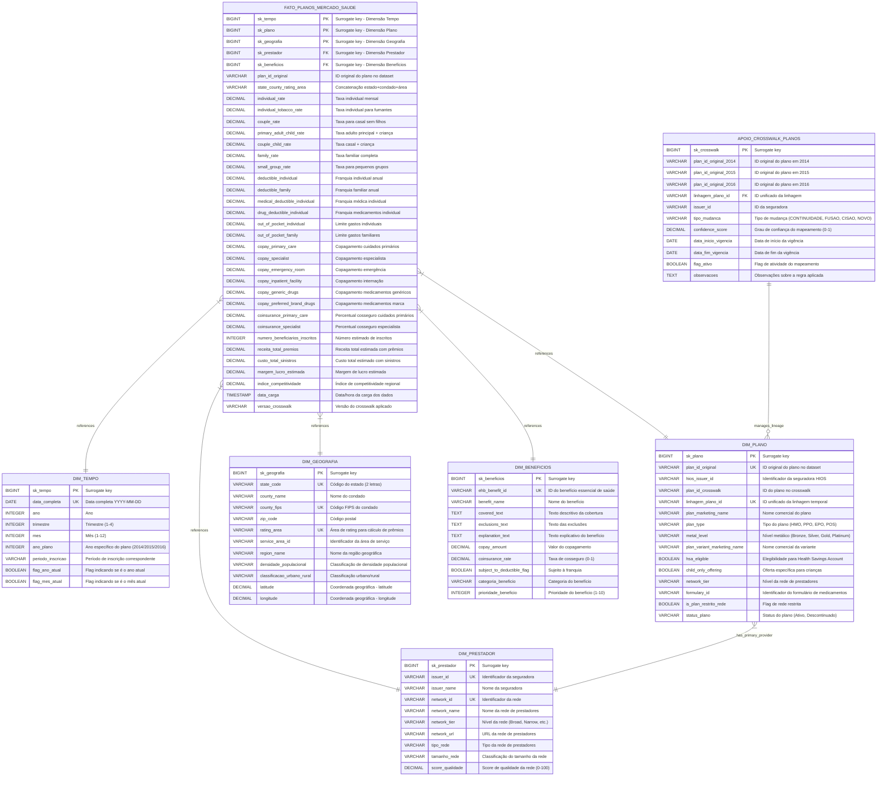

# Health Insurance Marketplace - Database Schema

This document describes the dimensional database schema for the Health Insurance Marketplace Data Warehouse project, including all tables, columns, and relationships following Kimball methodology.

## Entity Relationship Diagram

## Tables Description

### FATO_PLANOS_MERCADO_SAUDE (Fact Table)
**Purpose**: Central fact table containing quantitative measures for health insurance plans  
**Grain**: One health plan in a specific region during a specific time period  
**Type**: Transaction fact table with additive and semi-additive measures  
**Estimated Volume**: 2-3 million records (2014-2016), growing ~1M records/year  

**Primary Key**: Composite key (sk_plano, sk_tempo, sk_geografia)  
**Foreign Keys**: sk_tempo, sk_plano, sk_geografia, sk_prestador, sk_beneficios  

### DIM_TEMPO (Time Dimension)
**Purpose**: Temporal dimension with daily granularity and plan-specific hierarchies  
**Type**: Standard time dimension with plan year support  
**SCD Type**: Type 1 (no history tracking needed for time)  

**Primary Key**: sk_tempo (surrogate key)  
**Natural Key**: data_completa  

### DIM_PLANO (Plan Dimension)
**Purpose**: Central dimension for health insurance plans with temporal lineage support  
**Type**: Main dimension with crosswalk lineage implementation  
**SCD Type**: Type 2 (maintains history for plan changes)  

**Primary Key**: sk_plano (surrogate key)  
**Natural Keys**: plan_id_original, linhagem_plano_id  
**Foreign Key**: References DIM_PRESTADOR for primary provider  

### DIM_GEOGRAFIA (Geography Dimension)
**Purpose**: Geospatial dimension for territorial analysis and coverage desert identification  
**Type**: Geographic dimension with hierarchical structure  
**SCD Type**: Type 1 (geographic changes are rare)  

**Primary Key**: sk_geografia (surrogate key)  
**Natural Key**: Composite (state_code + county_fips + rating_area)  
**Spatial Support**: Includes latitude/longitude for geospatial analysis  

### DIM_PRESTADOR (Provider Dimension)
**Purpose**: Healthcare provider networks and insurers dimension  
**Type**: Organizational dimension  
**SCD Type**: Type 2 (maintains history for network changes)  

**Primary Key**: sk_prestador (surrogate key)  
**Natural Key**: Composite (issuer_id + network_id)  

### DIM_BENEFICIOS (Benefits Dimension)
**Purpose**: Specific benefits and coverage details dimension  
**Type**: Descriptive dimension for benefit analysis  
**SCD Type**: Type 1 (benefit definitions are relatively stable)  

**Primary Key**: sk_beneficios (surrogate key)  
**Natural Key**: ehb_benefit_id  

### APOIO_CROSSWALK_PLANOS (Crosswalk Support Table)
**Purpose**: Specialized table for managing temporal lineage between plan years  
**Type**: Bridge/Helper table for crosswalk implementation  
**Function**: Maps plan continuity across 2014-2016 periods  

**Primary Key**: sk_crosswalk (surrogate key)  
**Foreign Key**: linhagem_plano_id references DIM_PLANO  
**Relationship**: One lineage can span multiple plans across years  

## Relationships

- **FATO_PLANOS_MERCADO_SAUDE** has **many-to-one** relationships with all dimension tables
- **DIM_PLANO** has **many-to-one** relationship with **DIM_PRESTADOR** (primary provider)
- **APOIO_CROSSWALK_PLANOS** has **one-to-many** relationship with **DIM_PLANO** (via lineage)
- **Plan temporal lineage**: Managed through **linhagem_plano_id** across years (M:N controlled)

## Indexes Strategy

### FATO_PLANOS_MERCADO_SAUDE
- **PK_FATO_PLANOS**: Clustered index on (sk_plano, sk_tempo, sk_geografia)
- **IDX_FATO_TEMPO_PLANO**: Non-clustered on (sk_tempo, sk_plano)
- **IDX_FATO_GEOGRAFIA_RATES**: Covering index on sk_geografia including rate columns
- **IDX_FATO_CROSSWALK**: Non-clustered on (plan_id_original, sk_tempo)

### Dimension Tables
- **Primary Keys**: Clustered indexes on all surrogate keys
- **Natural Keys**: Unique non-clustered indexes on business keys
- **DIM_GEOGRAFIA**: Spatial index on (latitude, longitude)
- **DIM_PLANO**: Unique index on linhagem_plano_id for crosswalk integrity

## Data Quality Rules

1. **Referential Integrity**: All foreign keys must reference valid dimension records
2. **Crosswalk Integrity**: Each linhagem_plano_id must have valid confidence_score (0-1)
3. **Temporal Consistency**: Plan effective dates must align with time dimension
4. **Geographic Validation**: Coordinates must be within valid US boundaries
5. **Business Rules**: Individual rates ≤ family rates, deductibles ≤ out-of-pocket limits

## Usage Patterns

- **OLAP Queries**: Optimized for aggregations and drill-down operations
- **Temporal Analysis**: Supports year-over-year comparisons via crosswalk
- **Geospatial Analysis**: Enables coverage desert identification
- **Regulatory Reporting**: Maintains audit trail and data lineage
- **Predictive Analytics**: Provides base for medical inflation modeling
