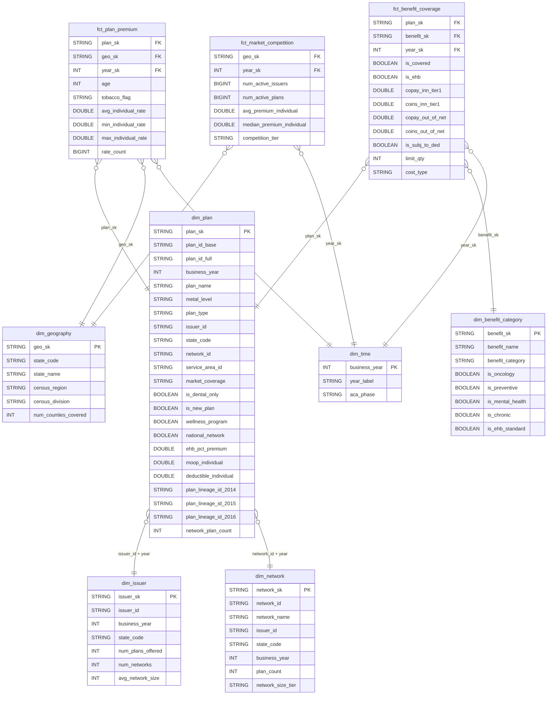

# Catálogo da Camada Gold — Health Insurance Marketplace

> Diagrama ER e dicionário de campos de todas as tabelas da camada Gold.
> Para as decisões de modelagem e os motivos de cada escolha, consulte [gold_layer.md](gold_layer.md).

---

## 1. Diagrama ER

> **Integridade referencial:** Athena/Iceberg não enforça FK constraints. A consistência é garantida pelo pipeline ETL — os INSERTs das fatos calculam as FKs com a mesma lógica de composição das dims (ex: `CONCAT(SUBSTR(planid,1,14), '_', year)`), de modo que um `plan_sk` órfão só ocorreria se um plano existisse na `rate` mas não na `plan_attributes`, o que é prevenido pelo JOIN obrigatório entre as duas tabelas nos INSERTs.

---

## 2. Dicionário de Campos

### 2.1 `dim_time`

| Campo | Tipo | Fonte Silver | Descrição |
|---|---|---|---|
| `business_year` | INT | hardcoded | Ano fiscal do Marketplace ACA. PK da dimensão. Valores possíveis: `2014`, `2015`, `2016`. |
| `year_label` | STRING | hardcoded | Rótulo textual para exibição em dashboards (ex: `'2014'`). Redundante com `business_year`, mas facilita ferramentas de BI que preferem strings em eixos. |
| `aca_phase` | STRING | hardcoded | Fase de implementação do ACA: `'Year 1'` (primeiro ano do Marketplace), `'Year 2'`, `'Year 3'`. Útil para segmentar análises de maturação do mercado — em Year 1, muitas seguradoras subprecificaram planos por falta de dados actuariais. |

---

### 2.2 `dim_geography`

| Campo | Tipo | Fonte Silver | Descrição |
|---|---|---|---|
| `geo_sk` | STRING | — | Surrogate key, igual a `state_code`. PK da dimensão. |
| `state_code` | STRING | `service_area.statecode` / hardcoded | Sigla de 2 letras do estado (padrão USPS/ISO 3166-2). O ACA opera em 50 estados + DC; estados que operam Exchange próprio (ex: CA, NY) **ainda aparecem** no dataset federal para planos SHOP. |
| `state_name` | STRING | hardcoded (VALUES) | Nome completo do estado. Não existe na Silver — inserido como seed estática para evitar dependência de tabela auxiliar. |
| `census_region` | STRING | hardcoded (VALUES) | Região do Censo Americano: `Northeast`, `Midwest`, `South`, `West`. Permite análise de padrões regionais de precificação (ex: Northeast historicamente tem os maiores prêmios). |
| `census_division` | STRING | hardcoded (VALUES) | Subdivisão do Censo (ex: `'East North Central'`). Granularidade intermediária entre região e estado — útil para agrupar estados com mercados de trabalho e demografia similares. |
| `num_counties_covered` | INT | `service_area.county` | Número de condados distintos com alguma cobertura registrada na Silver. Proxy do alcance geográfico dos planos dentro do estado — estados com muitos condados descobertos podem ter "desertos de cobertura". |

---

### 2.3 `dim_benefit_category`

| Campo | Tipo | Fonte Silver | Descrição |
|---|---|---|---|
| `benefit_sk` | STRING | derivado de `benefitname` | Surrogate key — hash MD5 de 32 chars do `benefit_name`. Determinístico: o mesmo nome sempre gera o mesmo SK, permitindo joins sem lookup table. |
| `benefit_name` | STRING | `benefits_cost_sharing.benefitname` | Nome original do benefício conforme submetido pelas seguradoras ao CMS (ex: `'Chemotherapy'`, `'Emergency Room Services'`). Pode ter variações ortográficas menores entre issuers — o pipeline trata os três benefícios oncológicos críticos por match exato. |
| `benefit_category` | STRING | derivado via CASE/LIKE | Categoria analítica padronizada: `oncology`, `preventive`, `mental_health`, `primary_care`, `specialist`, `emergency`, `pharmacy`, `maternity`, `chronic_mgmt`, `dental_vision`, `other`. Criada para agrupar os ~50+ nomes distintos de benefícios em categorias comparáveis entre seguradoras. |
| `is_oncology` | BOOLEAN | derivado | `TRUE` para `Chemotherapy`, `Radiation Therapy` e `Infusion Therapy` — os três benefícios diretamente relevantes para a Q1. Match exato (não LIKE) para evitar falsos positivos com nomes como "Non-Infusion Drugs". |
| `is_preventive` | BOOLEAN | derivado | `TRUE` para benefícios de prevenção primária (rastreamentos, vacinas, consultas de bem-estar infantil). Sob o ACA, esses benefícios são legalmente mandatados **sem cost-sharing** — planos que cobram copay aqui estão em violação regulatória. |
| `is_mental_health` | BOOLEAN | derivado | `TRUE` para saúde mental e abuso de substâncias. O ACA (via Mental Health Parity Act) exige que o cost-sharing de saúde mental seja equivalente ao de serviços médicos gerais — esse flag permite verificar cumprimento. |
| `is_chronic` | BOOLEAN | derivado | `TRUE` para serviços de cuidado contínuo: home health, skilled nursing, reabilitação. Relevante para a Q1 — pacientes oncológicos frequentemente precisam desses serviços entre ciclos de tratamento. |
| `is_ehb_standard` | BOOLEAN | `benefits_cost_sharing.isehb` (via `BOOL_OR`) | `TRUE` se o benefício é classificado como Essential Health Benefit em qualquer estado. Calculado com `BOOL_OR` porque a definição de EHB varia por estado (cada estado define seu benchmark). Benefícios EHB não podem ter annual dollar limits sob o ACA. |

---

### 2.4 `dim_issuer`

| Campo | Tipo | Fonte Silver | Descrição |
|---|---|---|---|
| `issuer_sk` | STRING | derivado | Surrogate key composta: `issuerid || '_' || businessyear`. Necessária porque a mesma seguradora pode operar em anos diferentes com portfólios distintos. |
| `issuer_id` | STRING | `plan_attributes.issuerid` | Identificador HIOS da seguradora — 5 dígitos numéricos atribuídos pelo CMS. Primeiros 2 dígitos identificam o estado de sede. Estável entre anos para a mesma entidade legal. |
| `business_year` | INT | `plan_attributes.businessyear` | Ano de referência. Coluna de particionamento Iceberg. |
| `state_code` | STRING | `plan_attributes.statecode` | Estado principal de operação da seguradora. Uma seguradora pode operar em múltiplos estados com `issuer_id` distintos por estado — o modelo trata cada `issuer_id` como uma entidade estadual independente. |
| `num_plans_offered` | INT | derivado de `plan_attributes.planid` | Contagem de planos base distintos (`SUBSTR(planid,1,14)`) oferecidos. Exclui variantes CSR (filtro `= '00'`) para não inflar o portfólio. Proxy do tamanho do portfólio comercial da seguradora. |
| `num_networks` | INT | derivado de `plan_attributes.networkid` | Número de redes de prestadores distintas usadas. Seguradoras com múltiplas redes geralmente oferecem produtos de diferentes níveis de custo (rede ampla para PPO caro, rede estreita para HMO barato). |
| `avg_network_size` | INT | derivado | `num_plans_offered / num_networks` — média de planos por rede. Valor alto indica redes compartilhadas por muitos produtos; valor próximo de 1 indica que cada produto tem sua própria rede isolada (estratégia de nicho). |

---

### 2.5 `dim_network`

| Campo | Tipo | Fonte Silver | Descrição |
|---|---|---|---|
| `network_sk` | STRING | derivado | Surrogate key: `networkid || '_' || businessyear`. |
| `network_id` | STRING | `network.networkid` | Identificador da rede de prestadores, atribuído pela seguradora. Formato: `XXYYYY` (estado + código interno). Não é globalmente único — duas seguradoras diferentes podem usar o mesmo `network_id` em estados diferentes. |
| `network_name` | STRING | `network.networkname` | Nome descritivo da rede conforme informado ao CMS (ex: `'Preferred Provider Network'`, `'HMO Select'`). Campo de texto livre — qualidade variável. |
| `issuer_id` | STRING | `network.issuerid` | Seguradora proprietária da rede. Uma rede pertence a exatamente um issuer; um issuer pode ter múltiplas redes. |
| `state_code` | STRING | `network.statecode` | Estado onde a rede opera. Redes com `national_network = TRUE` na `dim_plan` podem cobrir múltiplos estados, mas cada registro de rede é estadual. |
| `business_year` | INT | `network.businessyear` | Ano de referência. Coluna de particionamento. |
| `plan_count` | INT | derivado de `plan_attributes.planid` | Número de planos base distintos que utilizam esta rede. Proxy de tamanho da rede — o dataset não disponibiliza o número real de prestadores credenciados. |
| `network_size_tier` | STRING | derivado de `plan_count` | Classificação em 3 tiers: `'small'` (1–5 planos), `'medium'` (6–20), `'large'` (21+). Usada diretamente na análise Q4 para comparar prêmio por porte de rede. Os limiares foram calibrados para que cada tier represente aproximadamente 1/3 das redes no dataset. |

---

### 2.6 `dim_plan`

| Campo | Tipo | Fonte Silver | Descrição |
|---|---|---|---|
| `plan_sk` | STRING | derivado | Surrogate key: `CONCAT(SUBSTR(planid,1,14), '_', businessyear)`. Único por plano-base e ano. |
| `plan_id_base` | STRING | `plan_attributes.planid` (14 chars) | HIOS Plan ID truncado — os 14 caracteres que identificam o plano sem a variante CSR. Formato: `IIIIIPPPPPPPPP` (5 chars issuer + 9 chars plano). É o ID que aparece na tabela `rate`. |
| `plan_id_full` | STRING | `plan_attributes.planid` (17 chars) | HIOS Plan ID completo incluindo sufixo de variante (`-00`, `-04`, etc.). Mantido para rastreabilidade e debug — permite identificar de qual registro exato da Silver o plano foi derivado. Sempre termina em `-00` nesta dimensão (filtro Standard). |
| `business_year` | INT | `plan_attributes.businessyear` | Ano do plano. Coluna de particionamento Iceberg. |
| `plan_name` | STRING | `plan_attributes.PlanMarketingName` | Nome de marketing do plano (ex: `'Blue Shield Gold PPO'`). Campo de texto livre sem padronização entre issuers. Útil para exibição; não use para agrupamento analítico. |
| `metal_level` | STRING | `plan_attributes.MetalLevel` | Nível metálico ACA: `Bronze`, `Silver`, `Gold`, `Platinum`, `Catastrophic`. Define o actuarial value mínimo: Bronze ≈ 60%, Silver ≈ 70%, Gold ≈ 80%, Platinum ≈ 90%. Catastrophic só disponível para menores de 30 anos ou com hardship exemption. |
| `plan_type` | STRING | `plan_attributes.PlanType` | Tipo de rede do plano: `HMO` (rede fechada, coordenação por PCP), `PPO` (rede ampla, sem referral), `EPO` (rede fechada sem referral), `POS` (híbrido). Impacta diretamente o prêmio e a liberdade de escolha do paciente. |
| `issuer_id` | STRING | `plan_attributes.IssuerId` | FK lógica para `dim_issuer.issuer_id`. |
| `state_code` | STRING | `plan_attributes.statecode` | Estado onde o plano é comercializado. |
| `network_id` | STRING | `plan_attributes.NetworkId` | FK lógica para `dim_network.network_id`. Identifica qual rede de prestadores está associada ao plano. |
| `service_area_id` | STRING | `plan_attributes.ServiceAreaId` | Identificador da área geográfica de cobertura dentro do estado. Um issuer pode ter múltiplas service areas (ex: área metropolitana vs. rural). Planos com service areas distintos podem ter prêmios diferentes mesmo sendo o mesmo produto. |
| `market_coverage` | STRING | `business_rules.marketcoverage` | Segmento de mercado: `'Individual'` ou `'Small Group'`. A camada Gold inclui apenas `'Individual'` nos fatos, mas a dim mantém o campo para rastreabilidade. |
| `is_dental_only` | BOOLEAN | `business_rules.dentalonlyplan` | `TRUE` para planos exclusivamente odontológicos. Esses planos são regulados separadamente (ACA Seção 1302(b)(4)) e têm estrutura de benefícios incompatível com planos médicos. Excluídos dos fatos analíticos. |
| `is_new_plan` | BOOLEAN | `plan_attributes.IsNewPlan` | `TRUE` se o plano não existia no ano anterior. Planos novos não têm histórico de sinistros para calibrar prêmio — seguradoras frequentemente os subprecificam no primeiro ano e ajustam no segundo. Relevante para análise de variação YoY. |
| `wellness_program` | BOOLEAN | `plan_attributes.WellnessProgramOffered` | `TRUE` se o plano oferece programa de bem-estar (ex: desconto em academia, coaching de saúde). Pode ser usado como variável de diferenciação na Q3 (benefícios como variável de preço). |
| `national_network` | BOOLEAN | `plan_attributes.NationalNetwork` | `TRUE` se a rede de prestadores tem cobertura nacional. Relevante para a Q4: redes nacionais são tipicamente mais caras mas eliminam out-of-network costs para viajantes frequentes. |
| `ehb_pct_premium` | DOUBLE | `plan_attributes.EHBPercentTotalPremium` | Percentual do prêmio total destinado a cobrir Essential Health Benefits (0.0–1.0). Sob o ACA, planos não podem aplicar annual dollar limits em benefícios EHB — quanto maior essa fração, maior a cobertura mandatada. Varia por metal level e tipo de plano. |
| `moop_individual` | DOUBLE | `plan_attributes.MEHBInnTier1IndividualMOOP` | Maximum Out-Of-Pocket anual para o indivíduo (USD) — inclui apenas MEHB (Medical EHB), in-network, Tier 1. É o teto de desembolso do paciente por ano: após atingi-lo, o plano cobre 100% dos custos cobertos. O ACA estabelece limites máximos anuais (em 2016: $6.850 individual). Métrica central na Q1 para calcular exposição financeira de pacientes crônicos. |
| `deductible_individual` | DOUBLE | `plan_attributes.MEHBDedInnTier1Individual` | Franquia anual individual (USD) — valor que o paciente paga do próprio bolso antes de o plano começar a contribuir, para serviços MEHB in-network Tier 1. Planos Bronze têm deductibles altos (~$5.000–$6.000) em troca de prêmios baixos; Platinum têm deductibles próximos de zero. |
| `plan_lineage_id_2014` | STRING | `crosswalk2015.planid_2014` | HIOS Plan ID base do plano equivalente em 2014, conforme mapeamento CMS. `NULL` se o plano é novo em 2015/2016 sem predecessor. Permite rastrear evolução de prêmio do mesmo produto entre 2014 e 2016. |
| `plan_lineage_id_2015` | STRING | `crosswalk2015.planid_2015` | HIOS Plan ID base do equivalente em 2015. Para planos de 2016, obtido via `crosswalk2016`. |
| `plan_lineage_id_2016` | STRING | `crosswalk2016.planid_2015` (ref inversa) | HIOS Plan ID base do equivalente em 2016, visto a partir de um plano de 2015. Permite construir a cadeia completa 2014→2015→2016 a partir de qualquer ponto. |
| `network_plan_count` | INT | derivado de `plan_attributes` | Contagem de planos que compartilham o mesmo `network_id` no mesmo ano. Proxy de tamanho da rede — inclui variantes (não filtra `= '00'`) para representar o volume real de produtos na rede. |

---

### 2.7 `fct_plan_premium`

**Grão:** 1 linha por `(plan_id_base, state_code, business_year, age, tobacco_flag)`

| Campo | Tipo | Fonte Silver | Descrição |
|---|---|---|---|
| `plan_sk` | STRING | derivado de `rate` + `plan_attributes` | FK para `dim_plan`. Calculado como `CONCAT(SUBSTR(pa.planid,1,14), '_', r.businessyear)`. |
| `geo_sk` | STRING | `rate.statecode` | FK para `dim_geography`. Granularidade estadual — a tabela `rate` tem condados, mas agrega-se a estado para reduzir volume e alinhar com a `fct_market_competition`. |
| `year_sk` | INT | `rate.businessyear` | FK para `dim_time`. Coluna de particionamento Iceberg. |
| `age` | INT | `rate.age` | Idade do segurado em anos. Faixa: 21–64 (filtro aplicado no INSERT). A tabela `rate` original inclui idades individuais (0–64) e categorias compostas de família — apenas idades inteiras individuais adultas são mantidas. |
| `tobacco_flag` | STRING | `rate.tobacco` | Indica perfil de tabagismo: `'No Preference'` (taxa base sem surcharge) ou `'Tobacco User/Non-Tobacco User'` (taxa com surcharge de até 50% permitido pelo ACA). Não há distinção entre "usuário" e "não-usuário" no dado bruto. |
| `avg_individual_rate` | DOUBLE | `AVG(rate.individualrate)` | Prêmio médio mensal (USD) agregado por grupo `(plan, state, year, age, tobacco)`. A média é necessária porque a tabela `rate` pode ter múltiplas linhas por condado dentro de um estado — a agregação as consolida. |
| `min_individual_rate` | DOUBLE | `MIN(rate.individualrate)` | Prêmio mínimo observado no grupo. Útil para identificar o custo de entrada do plano em estados onde o mesmo plano opera em múltiplos service areas com preços diferentes. |
| `max_individual_rate` | DOUBLE | `MAX(rate.individualrate)` | Prêmio máximo observado no grupo. A diferença max–min dentro de um plano indica variação de precificação por área de serviço dentro do estado. |
| `rate_count` | BIGINT | `COUNT(*)` | Número de registros da Silver agregados. Útil para ponderar médias e detectar planos com poucos registros (menor confiabilidade estatística). Um plano presente em um único condado terá `rate_count = 1`; planos statewide terão dezenas. |

---

### 2.8 `fct_benefit_coverage`

**Grão:** 1 linha por `(plan_id_base, benefit_name, business_year)`

| Campo | Tipo | Fonte Silver | Descrição |
|---|---|---|---|
| `plan_sk` | STRING | derivado de `benefits_cost_sharing.planid` | FK para `dim_plan`. |
| `benefit_sk` | STRING | derivado de `benefits_cost_sharing.benefitname` | FK para `dim_benefit_category`. Calculado com `to_hex(md5(to_utf8(benefitname)))` — mesma função usada no INSERT de `dim_benefit_category`, garantindo integridade referencial. |
| `year_sk` | INT | `benefits_cost_sharing.businessyear` | FK para `dim_time`. Coluna de particionamento. |
| `is_covered` | BOOLEAN | `benefits_cost_sharing.iscovered` | `TRUE` se o plano cobre o benefício. Um benefício pode aparecer no catálogo mas não ser coberto — seguradoras são obrigadas a reportar todos os benefícios EHB mesmo que sua cobertura seja $0 ("carved out"). |
| `is_ehb` | BOOLEAN | `benefits_cost_sharing.isehb` | `TRUE` se este benefício é EHB **neste plano/estado específico** — diferente de `dim_benefit_category.is_ehb_standard`, que é o OR entre todos os estados. Usar este campo para verificar cumprimento regulatório por plano; usar o da dim para análises de mercado. |
| `copay_inn_tier1` | DOUBLE | `benefits_cost_sharing.copayinntier1` | Copagamento fixo in-network Tier 1 (USD). Valor determinístico por visita/sessão — o paciente sabe exatamente quanto pagará. `NULL` indica que a estrutura de custo é coinsurance (percentual), não copay fixo. Para quimioterapia, copays são raros e geralmente muito altos quando existem. |
| `coins_inn_tier1` | DOUBLE | `benefits_cost_sharing.coinsinntier1` | Coassegurado in-network Tier 1 (ex: `0.20` = paciente paga 20% do custo). `NULL` indica que a estrutura é copay. Para tratamentos oncológicos, coinsurance é a estrutura mais comum — e mais perigosa financeiramente, pois o custo total de um ciclo de quimioterapia pode superar $10.000. |
| `copay_out_of_net` | DOUBLE | `benefits_cost_sharing.copayoutofnet` | Copagamento fora da rede (USD). Planos HMO frequentemente têm este campo como `NULL` ou valor proibitivo — eles não cobrem serviços out-of-network exceto em emergências. |
| `coins_out_of_net` | DOUBLE | `benefits_cost_sharing.coinsoutofnet` | Coassegurado fora da rede. PPOs tipicamente têm coinsurance out-of-network entre 30–50%, enquanto in-network é 10–30%. A diferença quantifica o "custo de escolher livremente". |
| `is_subj_to_ded` | BOOLEAN | `benefits_cost_sharing.issubjtodedtier1` | `TRUE` se o cost-sharing deste benefício é aplicado **somente após o paciente esgotar o deductible**. Para quimioterapia, este campo é crítico: se `TRUE`, o paciente primeiro paga o deductible inteiro (ex: $5.000 em plano Bronze) antes de a coinsurance começar. `FALSE` significa que copay/coinsurance se aplica desde a primeira sessão, independente do deductible. |
| `limit_qty` | INT | `benefits_cost_sharing.limitqty` | Limite anual de sessões, visitas ou dias cobertos. `NULL` indica sem limite. Para radioterapia e infusão, seguradoras podem limitar o número de sessões cobertas — pacientes que excedem o limite pagam 100% do custo. Importante na Q1 para avaliar cobertura real de terapias contínuas. |
| `cost_type` | STRING | derivado (CASE) | Campo derivado que classifica a estrutura de custo: `'copay'` (só copay_inn_tier1 não nulo), `'coinsurance'` (só coins_inn_tier1 não nulo), `'both'` (ambos preenchidos — estrutura híbrida, rara), `'none'` (benefício coberto sem cost-sharing, ex: preventivos). Facilita filtros analíticos sem necessidade de verificar NULLs em dois campos. |

---

### 2.9 `fct_market_competition`

**Grão:** 1 linha por `(state_code, business_year)`

| Campo | Tipo | Fonte Silver | Descrição |
|---|---|---|---|
| `geo_sk` | STRING | `rate.statecode` | FK para `dim_geography`. A granularidade de mercado para análise de competição é o estado — é no nível estadual que as seguradoras registram produtos no Exchange. |
| `year_sk` | INT | `rate.businessyear` | FK para `dim_time`. Coluna de particionamento. |
| `num_active_issuers` | BIGINT | `COUNT(DISTINCT pa.IssuerId)` | Número de seguradoras com ao menos um plano individual ativo no estado naquele ano. "Ativa" é definida por ter registros na tabela `rate` com prêmio válido (>0, <3.000) — filtra seguradoras que submeteram planos mas não tinham beneficiários. |
| `num_active_plans` | BIGINT | `COUNT(DISTINCT SUBSTR(pa.planid,1,14))` | Total de planos base distintos disponíveis no estado. Separado de `num_active_issuers` porque uma seguradora pode oferecer múltiplos planos — a relação entre as duas métricas indica a diversidade de portfólio por issuer. |
| `avg_premium_individual` | DOUBLE | `AVG(rate.individualrate)` | Prêmio médio mensal (USD) para o perfil CMS padrão: 27 anos, sem preferência de tabaco. Média de todos os planos e condados do estado — representa o "custo de entrada no mercado" para um jovem adulto típico. |
| `median_premium_individual` | DOUBLE | `approx_percentile(..., 0.5)` | Prêmio mediano para o mesmo perfil CMS. Calculado com `approx_percentile` (Quantile Digest, ~1% de erro relativo) pois o Athena não tem `MEDIAN()` nativo. A mediana é mais robusta que a média em mercados com poucos planos de altíssimo custo que inflariam a média. |
| `competition_tier` | STRING | derivado de `num_active_issuers` | Classificação qualitativa do nível de competição: `'monopoly'` (1 issuer), `'low'` (2–3), `'moderate'` (4–6), `'high'` (7+). Permite análise categórica sem necessidade de lidar com a distribuição discreta de `num_active_issuers` nas queries analíticas. Os limiares são baseados em benchmarks da literatura de economia de saúde do ACA. |
